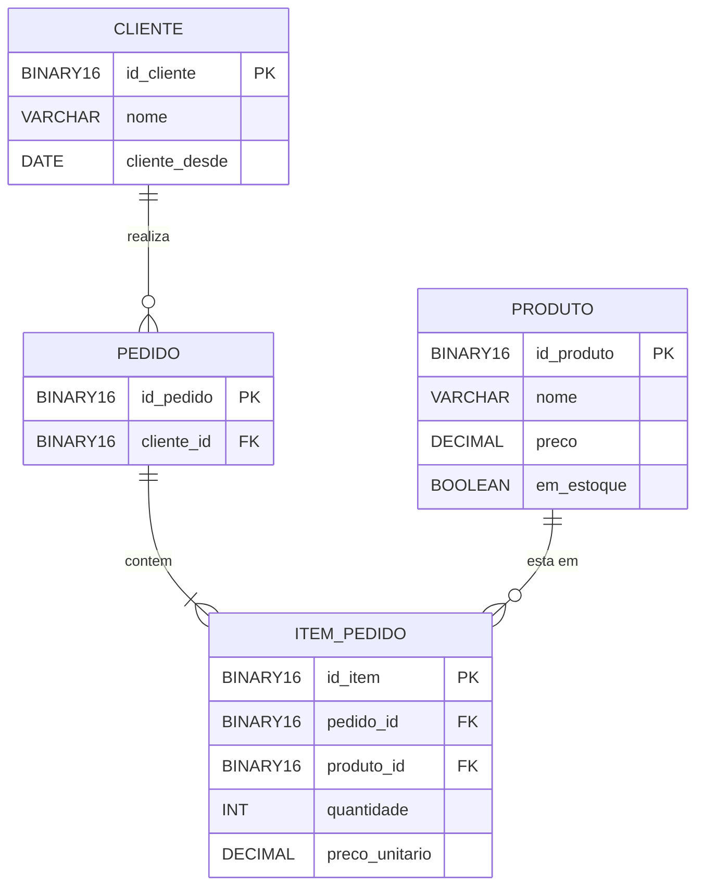

 🥟 Baozi Store API

API REST de uma loja virtual desenvolvida em **Java** com **Spring Boot**, como projeto acadêmico. O sistema permite cadastrar clientes e produtos e registrar pedidos, com cálculo automático de subtotais e total.


## 📑 Sumário

- [Sobre o projeto](#-sobre-o-projeto)
- [Tecnologias](#-tecnologias)
- [Funcionalidades e regras de negócio](#-funcionalidades-e-regras-de-negócio)
- [Arquitetura](#-arquitetura)
- [Modelo de dados](#-modelo-de-dados)
- [Como executar](#-como-executar)
- [Endpoints da API](#-endpoints-da-api)
- [Exemplos de uso](#-exemplos-de-uso)
- [Tratamento de erros](#-tratamento-de-erros)
- [Limitações conhecidas e melhorias futuras](#-limitações-conhecidas-e-melhorias-futuras)
- [Autor](#-autor)

## 📖 Sobre o projeto

A **Baozi Store API** simula o núcleo de um sistema de compras: um **cliente** faz um **pedido** contendo um ou mais **itens**, e cada item referencia um **produto** e uma quantidade. O preço do produto no momento da compra é gravado no item do pedido, de modo que alterações futuras de preço não afetam pedidos já realizados.

O projeto foi organizado em camadas (`controller`, `service`, `repository` e `model`) e utiliza DTOs para separar o que entra e sai da API das entidades persistidas.

## 🛠 Tecnologias

| Tecnologia | Uso |
| --- | --- |
| Java 21 | Linguagem |
| Spring Boot 4.1.1 | Framework base da aplicação |
| Spring Web | Criação dos endpoints REST |
| Spring Data JPA / Hibernate | Persistência e mapeamento objeto-relacional |
| MySQL 8.4 | Banco de dados relacional |
| Lombok | Geração de getters e setters |
| Docker Compose | Subida do banco de dados em contêiner |
| Maven (Maven Wrapper) | Gerenciamento de dependências e build |
| JUnit 5 (`spring-boot-starter-test`) | Testes |

## ✅ Funcionalidades e regras de negócio

**Clientes**
- Cadastro, consulta por ID, listagem e exclusão.
- A data `clienteDesde` é preenchida automaticamente com a data atual no cadastro.
- A listagem é ordenada do cliente mais antigo para o mais recente.

**Produtos**
- Cadastro, consulta por ID, listagem e exclusão.
- Todo produto novo é criado com `emEstoque = true`.
- A listagem retorna **apenas produtos em estoque**.

**Pedidos**
- Um pedido pertence a um cliente e possui uma lista de itens (produto + quantidade).
- O cliente informado precisa existir.
- Cada produto informado precisa existir e estar em estoque.
- O `precoUnitario` de cada item é copiado do produto no momento do pedido.
- O subtotal de cada item (`precoUnitario × quantidade`) e o total do pedido são calculados na resposta.
- A criação do pedido e de seus itens acontece em uma única transação.

## 🏗 Arquitetura

```
baozi-store-api
├── compose.yaml                  # Banco MySQL em contêiner
├── db.sql                        # Script de criação das tabelas
├── pom.xml
└── src
    ├── main
    │   ├── java/com/api/baozistore/system
    │   │   ├── Application.java
    │   │   ├── controller        # Endpoints REST
    │   │   │   └── Dtos          # Objetos de entrada e saída (records)
    │   │   ├── service           # Regras de negócio
    │   │   ├── repository        # Interfaces Spring Data JPA
    │   │   └── model             # Entidades JPA
    │   └── resources
    │       └── application.properties
    └── test
        └── java/com/api/baozistore/system/ApplicationTests.java
```

Fluxo de uma requisição:

```
Cliente HTTP → Controller → Service → Repository → MySQL
                  ↑            │
                  └── DTOs ────┘
```

## 🗄 Modelo de dados



Os identificadores de todas as entidades são **UUID**, armazenados como `BINARY(16)`. O esquema é criado pelo arquivo `db.sql` e a aplicação usa `spring.jpa.hibernate.ddl-auto=validate`, ou seja, o Hibernate apenas **valida** se as entidades correspondem às tabelas, sem alterá-las.

## 🚀 Como executar

### Pré-requisitos

- [JDK 21](https://adoptium.net/)
- [Docker](https://www.docker.com/) com Docker Compose
- Não é necessário instalar o Maven, pois o projeto inclui o Maven Wrapper.

### Passo a passo

**1. Clone o repositório**

```bash
git clone <url-do-repositorio>
cd baozi-store-api
```

**2. Suba o banco de dados**

```bash
docker compose up -d
```

Isso inicia um MySQL 8.4 na porta `3306`, cria o banco `pedidos_db` e executa o `db.sql` automaticamente. O script de inicialização só roda quando o volume `mysql_data` ainda está vazio. Para recriar o banco do zero, use `docker compose down -v` e suba novamente.

**3. Execute a aplicação**

```bash
# Linux / macOS
./mvnw spring-boot:run

# Windows
mvnw.cmd spring-boot:run
```

A API ficará disponível em `http://localhost:8080`.

### Configuração

As credenciais de acesso ao banco estão definidas em dois lugares, que precisam estar sincronizados:

- `compose.yaml` (`MYSQL_ROOT_PASSWORD`, `MYSQL_DATABASE`)
- `src/main/resources/application.properties` (`spring.datasource.*`)

### Testes

```bash
./mvnw test
```

O projeto possui atualmente o teste `contextLoads`, que verifica se o contexto do Spring inicia corretamente. Por isso, o banco de dados precisa estar em execução ao rodar os testes.

## 🔌 Endpoints da API

URL base: `http://localhost:8080/api`

### Clientes

| Método | Rota | Descrição | Resposta de sucesso |
| --- | --- | --- | --- |
| `POST` | `/clientes` | Cadastra um cliente | `201 Created` |
| `GET` | `/clientes` | Lista todos os clientes | `200 OK` |
| `GET` | `/clientes/{idCliente}` | Busca um cliente por ID | `200 OK` |
| `DELETE` | `/clientes/{idCliente}` | Remove um cliente | `204 No Content` |

### Produtos

| Método | Rota | Descrição | Resposta de sucesso |
| --- | --- | --- | --- |
| `POST` | `/produtos` | Cadastra um produto | `201 Created` |
| `GET` | `/produtos` | Lista os produtos em estoque | `200 OK` |
| `GET` | `/produtos/{idProduto}` | Busca um produto por ID | `200 OK` |
| `DELETE` | `/produtos/{idProduto}` | Remove um produto | `204 No Content` |

### Pedidos

| Método | Rota | Descrição | Resposta de sucesso |
| --- | --- | --- | --- |
| `POST` | `/pedidos` | Cria um pedido | `201 Created` |
| `GET` | `/pedidos` | Lista todos os pedidos | `200 OK` |
| `GET` | `/pedidos/{idPedido}` | Busca um pedido por ID | `200 OK` |
| `DELETE` | `/pedidos/{idPedido}` | Remove um pedido e seus itens | `204 No Content` |

Nas rotas `POST`, a resposta inclui o cabeçalho `Location` com a URL do recurso criado.

## 💡 Exemplos de uso

> Os exemplos usam `curl`. No Windows, prefira `curl.exe` no PowerShell ou uma ferramenta como Postman ou Insomnia.

### 1. Cadastrar um cliente

```bash
curl -X POST http://localhost:8080/api/clientes \
  -H "Content-Type: application/json" \
  -d '{"nome": "Maria Silva"}'
```

Resposta:

```json
{
  "idCliente": "3f2b8c1e-7a4d-4c55-9b0e-1d2f6a8e9c10",
  "nome": "Maria Silva",
  "clienteDesde": "2026-09-23"
}
```

### 2. Cadastrar um produto

```bash
curl -X POST http://localhost:8080/api/produtos \
  -H "Content-Type: application/json" \
  -d '{"nome": "Baozi de carne", "preco": 12.50}'
```

Resposta:

```json
{
  "idProduto": "a91c4e02-5d3b-4f7a-8e16-0b7c2d9f3a44",
  "nome": "Baozi de carne",
  "preco": 12.50,
  "emEstoque": true
}
```

### 3. Criar um pedido

```bash
curl -X POST http://localhost:8080/api/pedidos \
  -H "Content-Type: application/json" \
  -d '{
    "clienteId": "3f2b8c1e-7a4d-4c55-9b0e-1d2f6a8e9c10",
    "itens": [
      { "produtoId": "a91c4e02-5d3b-4f7a-8e16-0b7c2d9f3a44", "quantidade": 3 }
    ]
  }'
```

Resposta:

```json
{
  "id": "c7d05b19-2e8a-4a36-b1f4-6e3a9d0c5b72",
  "clienteId": "3f2b8c1e-7a4d-4c55-9b0e-1d2f6a8e9c10",
  "itens": [
    {
      "produtoId": "a91c4e02-5d3b-4f7a-8e16-0b7c2d9f3a44",
      "quantidade": 3,
      "precoUnitario": 12.50,
      "subtotal": 37.50
    }
  ],
  "total": 37.50
}
```

Os UUIDs acima são apenas ilustrativos. Use os IDs retornados nas suas próprias requisições.

## ⚠️ Tratamento de erros

As regras de negócio lançam exceções quando algo está inválido:

| Situação | Exceção lançada |
| --- | --- |
| Cliente, produto ou pedido não encontrado | `EntityNotFoundException` |
| Produto do pedido inexistente | `IllegalStateException` |
| Produto do pedido fora de estoque | `IllegalStateException` |

Como ainda não há um tratador global de exceções (`@RestControllerAdvice`), essas exceções resultam, por padrão, em uma resposta **HTTP 500**. Mapear cada uma para o status adequado (por exemplo, 404 e 409) está previsto nas melhorias futuras.

## 🔧 Limitações conhecidas e melhorias futuras

- [ ] Criar um `@RestControllerAdvice` para retornar `404 Not Found` e `409 Conflict` com mensagens padronizadas.
- [ ] Validar as entradas com Bean Validation (nome obrigatório, preço positivo, quantidade maior que zero, lista de itens não vazia).
- [ ] Impedir a exclusão de clientes e produtos que já possuem pedidos. Hoje as chaves estrangeiras do banco bloqueiam essa operação com erro.
- [ ] Permitir atualizar produtos (preço e disponibilidade em estoque) e clientes.
- [ ] Controlar a quantidade em estoque, em vez de apenas o indicador `emEstoque`.
- [ ] Registrar a data e o status do pedido.
- [ ] Adicionar autenticação e autorização (Spring Security).
- [ ] Mover as credenciais do banco para variáveis de ambiente.
- [ ] Ampliar a cobertura de testes (unitários dos serviços e de integração dos endpoints).
- [ ] Documentar a API com Swagger / OpenAPI.
